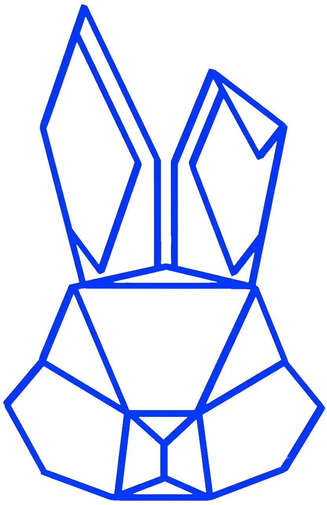
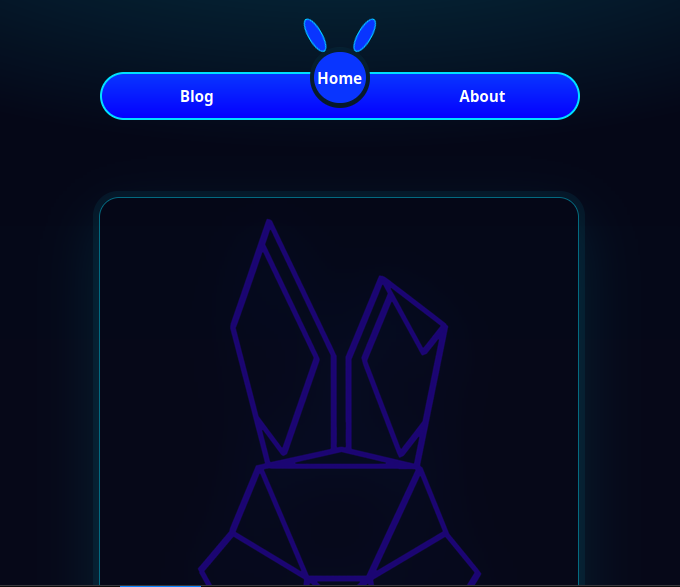
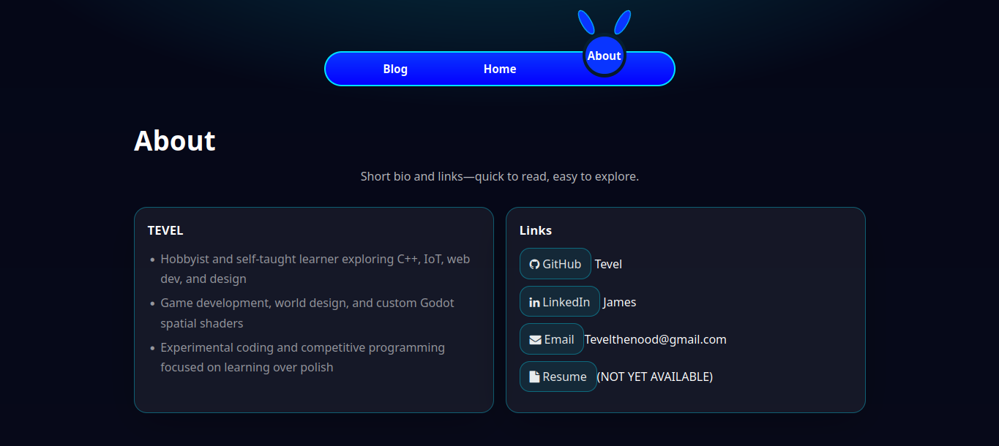
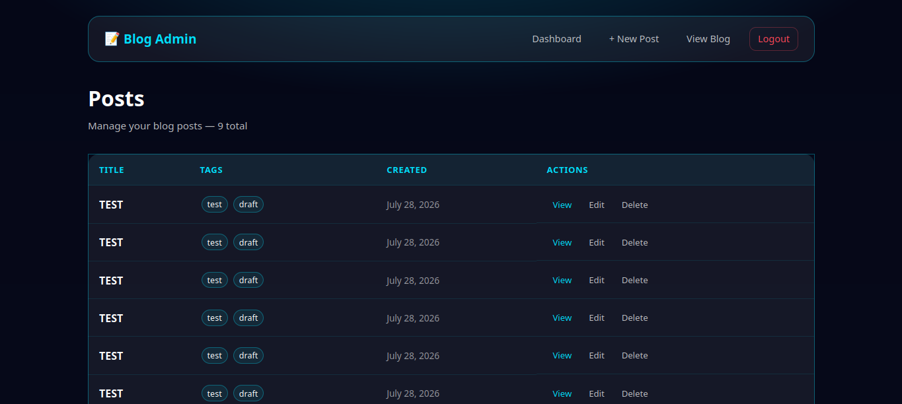
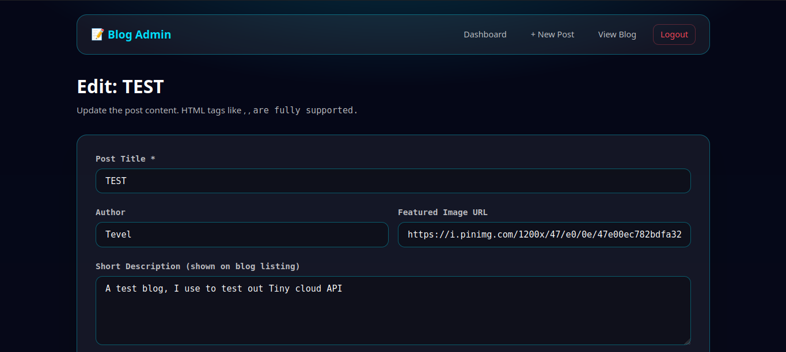

<p align="center">
  
</p>

# <p align="center">Tevel's Dev Blog</p>
## Language

[](https://github.com/Tadataka-Rei/Personal_blog/blob/main/README.VI.md)
---
A dark-themed personal blog platform built for **Tevel**(me). The project combines a **lightweight static frontend** (HTML/CSS/vanilla JS) with a **PHP admin panel** for full CRUD management of blog posts.
<div align="center">


</div>

Posts are stored as **JSON files organized by month**, with a generated `post-count.js` catalog that powers fast, lazy-loaded pagination on the frontend. Everything runs through **Docker Compose** with two services: a PHP 8.1 FPM + nginx backend (admin) and an `nginx:alpine` static frontend.

<details>
<summary><strong>💡 Why JSON instead of a database?</strong></summary>

This project intentionally stores posts in monthly JSON files rather than using MySQL or SQLite.

- Running on a 2GB Ram TV Box
- Zero database setup
- Minimal RAM usage
- Easy backups
- Perfect for single-admin blogs
- Ideal for low-powered hardware

The admin panel still provides full CRUD while the frontend remains completely static.

</details>


---
## 📑 Table of Contents
- [📸 Screenshots](#-screenshots)
- [✨ Features](#-features)
  - [🌐 Frontend](#-frontend-static-no-build-step)
  - [🔐 Admin Panel](#-admin-panel-php-backend)
- [📁 Project Structure](#-project-structure)
- [🚀 Run Locally](#-run-locally)
  - [Prerequisites](#prerequisites)
  - [Steps](#steps)
  - [Run without Docker](#run-without-docker-optional)
- [🔧 Environment Variables](#-environment-variables)
- [🎨 Color Reference](#-color-reference)
  - [Core Palette](#core-palette)
  - [Admin Status Colors](#admin-status-colors)
  - [Background Gradient](#background-gradient)
- [🚢 Deployment](#-deployment)
  - [Production Build](#production-build-docker)
  - [Reverse Proxy](#reverse-proxy-optional)
  - [Production Considerations](#production-considerations)
- [⭐ Support](#-support)
- [📝 License](#-license)

---
## 📸 Screenshots

### Home

<p align="center">
  
</p>

### Blog

<p align="center">
  
</p>

### Admin Dashboard

<p align="center">
  
</p>

### Editor

<p align="center">
  
</p>

---
## ✨ Features

### 🌐 Frontend (static, no build step)

- **Home page** — Hero section with site logo and a signature quote
- **Animated navigation** — A custom CSS "rabbit" that appears on the active nav item with floating ears animation
- **Blog listing** — Responsive 2-column post card grid (1-column on mobile)
- **Lazy pagination** — 8 posts per page; only the needed monthly JSON files are fetched for the current page
- **Live search** — Instant filtering across post titles, descriptions, and tags (searches all months)
- **Post detail pages** — Author, published/updated dates, featured image, lead paragraph, content sections, and tag chips
- **Modern dark UI** — CSS variables, gradients, glow effects, and smooth hover transitions

### 🔐 Admin Panel (PHP backend)

- **Session-based authentication** — Login/logout with credentials from environment variables
- **Dashboard** — Lists all posts with tags, dates, and quick actions (View / Edit / Delete)
- **Create & edit posts** — Rich **TinyMCE WYSIWYG** editor supporting images, links, code, tables, media, and full HTML
- **Dynamic content sections** — Add/remove/renumber multiple heading + content sections per post
- **Tag input** — Press Enter or comma to add tags, Backspace to remove, rendered as chips
- **Featured images** — Set a custom image URL or leave empty for a random placeholder
- **Delete confirmation** — Guarded delete flow with post-ID display
- **Monthly JSON storage** — Posts are automatically organized into `posts-MM-YYYY.json` (summaries) and `posts-data-MM-YYYY.json` (full data)
- **Auto catalog generation** — `post-count.js` (`window.POST_COUNT`) is regenerated on every write for instant frontend pagination
- **Legacy migration** — Best-effort automatic migration from the old single-file `posts.json` layout

---

## 📁 Project Structure

```
backend/
 ├── assets/
 ├── includes/
 ├── create.php
 ├── edit.php
 └── ...

frontend/
 ├── public/
 ├── src/
 └── data/

docker/
Dockerfile
docker-compose.yml

```

---

## 🚀 Run Locally

### Prerequisites

- **Docker** & **Docker Compose** installed on your machine

### Steps

1. **Clone the repository**

   ```bash
   git clone https://github.com/Tadataka-Rei/Personal_blog.git
   cd Personal_blog
   ```

2. **Create your environment file**

   ```bash
   cp .env.example .env
   ```

   Edit `.env` and change the admin credentials, ports, and add your TinyMCE API key (see [Environment Variables](#-environment-variables)).
3. **Set permissions for the data directory**

   Docker needs write access to `Personal_blog/frontend/data` so it can create, modify, and execute files.

   **Linux/macOS**

   ```bash
   sudo chown -R $USER:$USER frontend/data
   chmod -R 775 frontend/data
   ```

   > If your container runs as a different user (for example `www-data`), you may need to replace `$USER:$USER` with the appropriate user and group.

   **Windows (PowerShell)**

   If you're using Docker Desktop with WSL2, no additional steps are usually required.

   If you're using Windows containers or encounter permission issues, run:

   ```powershell
   icacls .\frontend\data /grant Users:(OI)(CI)M /T
   ```

   This grants users permission to create, modify, and delete files within the directory.

4. **Build and start the containers**

   ```bash
   docker compose up -d --build
   ```

5. **Open the site**

   | Service  | URL                            |
   | -------- | ------------------------------ |
   | Frontend | http://localhost:3000/         |
   | Admin    | http://localhost:8080/backend/ |

6. **Log in to the admin panel** with the credentials set in your `.env` (defaults: `admin` / `admin123`).

> [!IMPORTANT]
> Change the default admin credentials before deploying.


### Run without Docker (optional)

Requires **PHP 8.1+** with the `zip` extension and **nginx** (or any PHP-FPM capable server).

- Point your web root to `frontend/public/` for the frontend.
- Configure a PHP-FPM location for the `backend/` directory (see `backend/nginx.conf` for the upstream config).
- Serve the `frontend/data/` directory statically (it contains JSON + JS files).
- Ensure the web-server user has write permissions on `frontend/data/` and `backend/`.
- Add in ../ in front of every path in frontend and backend.
---

## 🔧 Environment Variables

All configuration is read from `.env` (see `.env.example`). The backend loads it automatically via `backend/includes/config.php`.

| Variable           | Default                  | Description                                                        |
| ------------------ | ------------------------ | ------------------------------------------------------------------ |
| `BACKEND_PORT`     | `8080`                   | Host port mapped to the admin backend container (`:80`)            |
| `FRONTEND_PORT`    | `3000`                   | Host port mapped to the static frontend container (`:80`)          |
| `ADMIN_USERNAME`   | `admin`                  | Admin panel login username                                         |
| `ADMIN_PASSWORD`   | `admin123`               | Admin panel login password                                         |
| `TINYMCE_API_KEY`  | *(empty)*                | TinyMCE Cloud API key — get one free at <https://www.tiny.cloud/>  |
| `SITE_URL`         | `http://localhost:8080`  | Public-facing URL of the admin panel (used for admin panel links)  |
| `DATA_DIR`         | *(auto)*                 | Override the JSON data directory (defaults to `frontend/data`)     |

### Notes

- `TINYMCE_API_KEY` — leave empty to fall back to the TinyMCE self-hosted build (editor features may be limited).
- `DATA_DIR` — in Docker, this is set to `/var/www/html/frontend/data` and mounted as a bind volume so the admin and frontend share the same data.

---

## 🎨 Color Reference

The UI uses a dark theme driven by CSS custom properties. Below are the primary tokens used across the frontend and admin panel.

### Core Palette

| Token           | Value                     | Usage                                       |
| --------------- | ------------------------- | ------------------------------------------- |
| `--blue`        | 	<span style="display:inline-block;width:40px;height:20px;background:#0935ff;border-radius:4px;"></span>                 | Primary blue — navbar, buttons, rabbit logo |
| `--cyan`        | 	<span style="display:inline-block;width:40px;height:20px;background:#00e1ff;border-radius:4px;"></span>               | Accent cyan — links, borders, focus states  |
| `--white`       | 	<span style="display:inline-block;width:40px;height:20px;background:#ffffff;border:1px solid #999;border-radius:4px;"></span>                 | Primary text color                          |
| `--bg`          | 	<span style="display:inline-block;width:40px;height:20px;background:#070a1a;border-radius:4px;"></span>                 | Base dark background color                  |
| `--muted`       | <span style="display:inline-block;width:40px;height:20px;background:#ffffffb8;border-radius:4px;"></span>   | Secondary text (72% opacity)                |
| `--muted2`      | <span style="display:inline-block;width:40px;height:20px;background:#ffffff8c;border-radius:4px;"></span>   | Tertiary/hint text (55% opacity)            |
| `--card`        | <span style="display:inline-block;width:40px;height:20px;background:#ffffff0f;border-radius:4px;"></span>   | Card & panel backgrounds                    |
| `--border`      | <span style="display:inline-block;width:40px;height:20px;background:#00e1ff59;border-radius:4px;"></span>     | Borders, dividers, outline glows            |

### Admin Status Colors

| Token        | Value      | Usage                    |
| ------------ | ---------- | ------------------------ |
| `--danger`   | 	<span style="display:inline-block;width:40px;height:20px;background:#ff4757;border-radius:4px;"></span>  | Delete actions, errors   |
| `--success`  | <span style="display:inline-block;width:40px;height:20px;background:#2ed573;border-radius:4px;"></span>  | Success alerts/messages  |
| `--warning`  | <span style="display:inline-block;width:40px;height:20px;background:#ffa502;border-radius:4px;"></span>  | Warning alerts           |

### Background Gradient

The signature page background is a layered gradient:

```css
background:
  radial-gradient(1200px 500px at 50% -150px, rgba(0,225,255,.22), transparent 60%),
  linear-gradient(180deg, #050717 0%, #070a1a 100%);
```

- **`#050717`** — top of the linear gradient (near-black blue)
- **`#070a1a`** — bottom of the linear gradient (`--bg`)
- **`rgba(0,225,255,.22)`** — cyan radial glow at the top

> 💡 To customize the theme, update the CSS variables in `frontend/src/css/style.css` (base tokens) and the per-page sheets (`home.css`, `blog.css`, `post.css`, `about.css`), plus `backend/assets/css/admin.css` for the admin panel.

---

## 🚢 Deployment

### Production build (Docker)

1. **Prepare your `.env`** — set strong admin credentials, your domain as `SITE_URL`, and your `TINYMCE_API_KEY`.

2. **Build and start**

   ```bash
   docker compose up -d --build
   ```

3. **Verify the services**

   ```bash
   docker compose ps
   ```

   Both containers (`blog-backend`, `blog-frontend`) should report `Up` and healthy.

### Reverse proxy (optional)

For a public deployment, place the app behind a reverse proxy (e.g., **Caddy**, **nginx**, or **Traefik**) and point a domain at:

- `http://localhost:8080` → admin (`/backend/`)
- `http://localhost:3000` → frontend

Update `SITE_URL` in `.env` to the public admin URL (e.g., `https://blog.example.com`) and restart:

```bash
docker compose up -d
```

### Production considerations

- **Change default credentials** — never keep `admin` / `admin123` in production.
- **Set `TINYMCE_API_KEY`** — required for full WYSIWYG editor features.
- **Set `SITE_URL`** — to your real domain so admin panel links resolve correctly.
- **Remove the dev bind mounts** — in `docker-compose.yml`, the backend service mounts the entire project (`.:/var/www/html`) and `./frontend/data` for live development. For production, remove these volume entries or replace them with a named volume (`blog-data`) so data persists independently of the code.
- **Back up the data** — all content lives in `frontend/data/` (or your `DATA_DIR`). Back it up regularly.

---

## ⭐ Support
<div align="center">

If you found this project useful, consider giving it a ⭐ on GitHub.

You can also support me on Ko-fi:
[](https://ko-fi.com/ratasleepy)
</div>

---

<p align="center">Made with coffee by Tevel</p>
